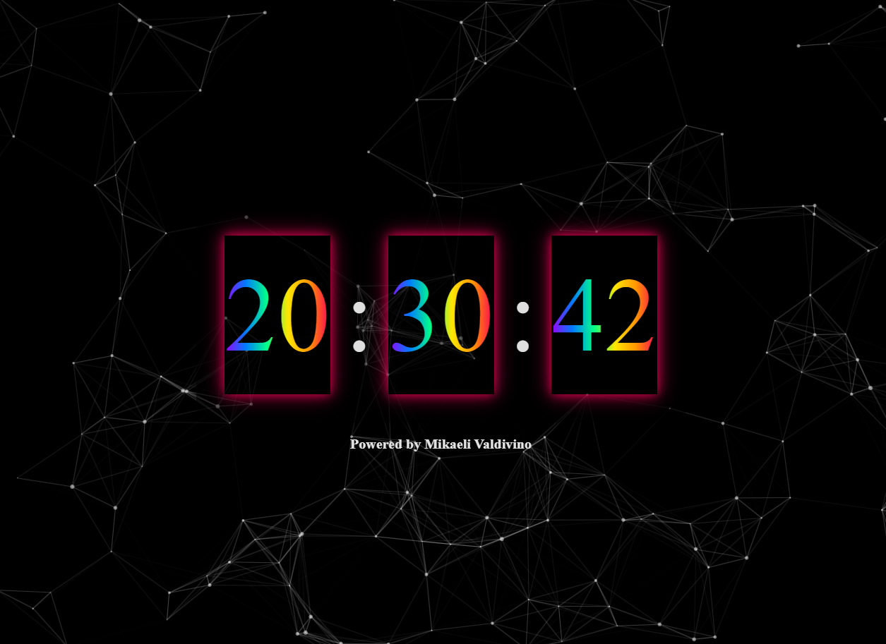

# Relógio Digital Avançado

Este projeto é um relógio digital interativo e visualmente atraente, desenvolvido por **Mikaeli Valdivino**, que utiliza HTML, CSS (com Tailwind CSS) e JavaScript. Ele apresenta um fundo dinâmico de partículas e animações para os números do relógio, proporcionando uma experiência moderna e envolvente.

## Funcionalidades

- **Relógio Digital**: Exibe a hora atual em formato HH:MM:SS, com atualização automática a cada segundo.
- **Animações**: Efeitos de "flip" nas mudanças de hora, minuto e segundo, além de uma animação de pulso nos dois pontos que separam as unidades de tempo.
- **Efeitos Visuais**: Fundo com partículas que reagem a interações do usuário (hover e clique).
- **Som de Tick**: Efeito sonoro que é acionado a cada segundo, melhorando a experiência do usuário.

## Estrutura do Projeto

- **HTML**: Define a estrutura básica da página, incluindo o relógio e a área de partículas.
- **CSS**: Utiliza Tailwind CSS para estilização rápida e responsiva, com classes utilitárias.
- **JavaScript**: Gerencia a lógica do relógio, incluindo a atualização do tempo e a inicialização do efeito de partículas.

## Como Usar

1. Clone ou baixe o repositório.
2. Abra o arquivo `index.html` em um navegador moderno.
3. Aprecie o relógio digital e suas animações!

## Créditos

Desenvolvido por **Mikaeli Valdivino**.

## Demonstração

> Nota: O projeto requer acesso à internet para carregar a biblioteca Particles.js.

